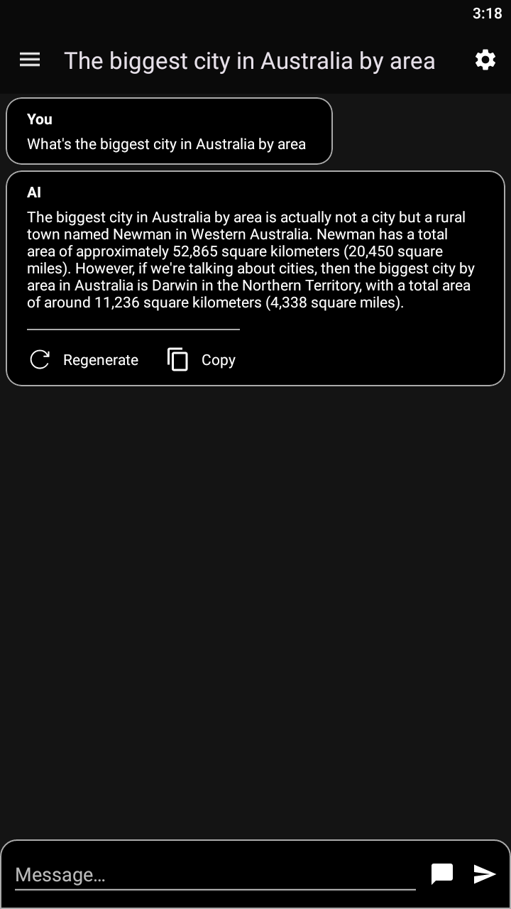
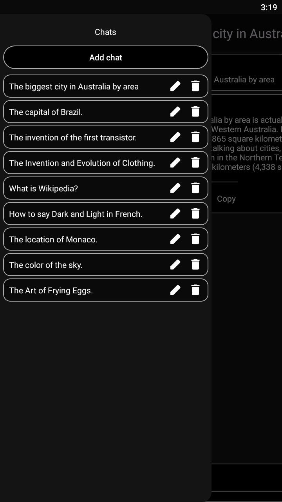
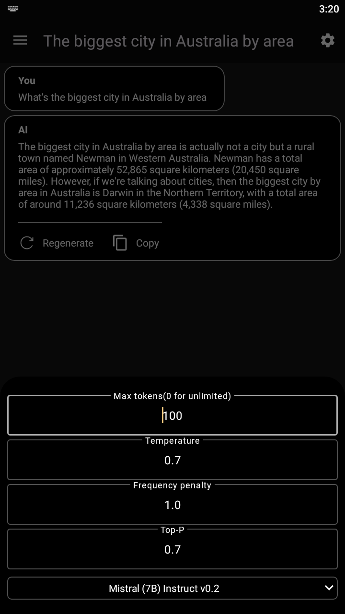
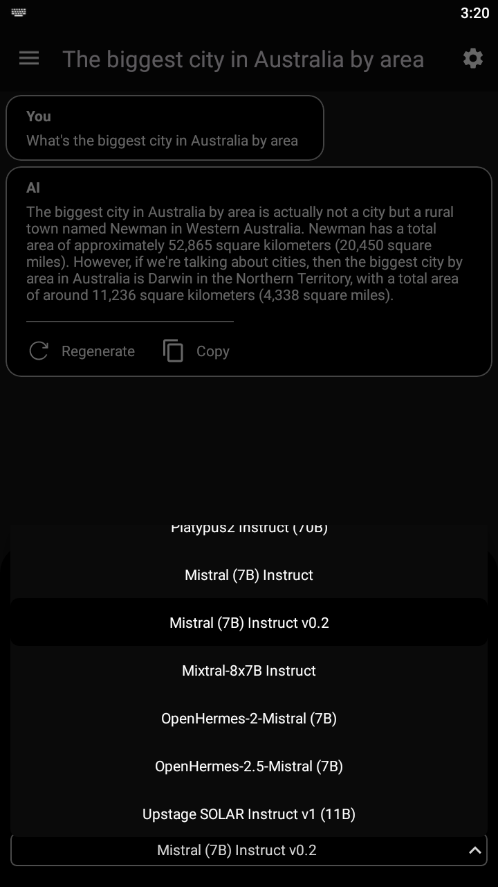
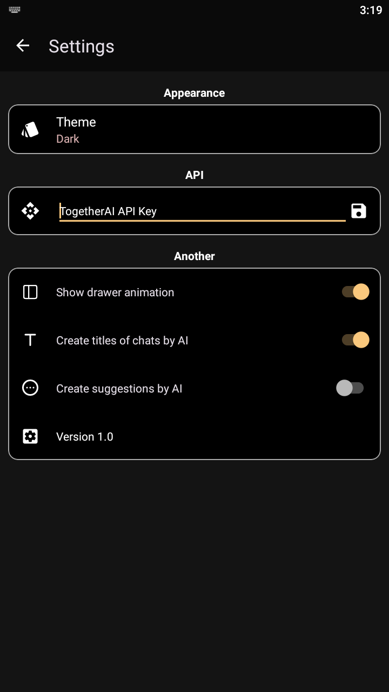
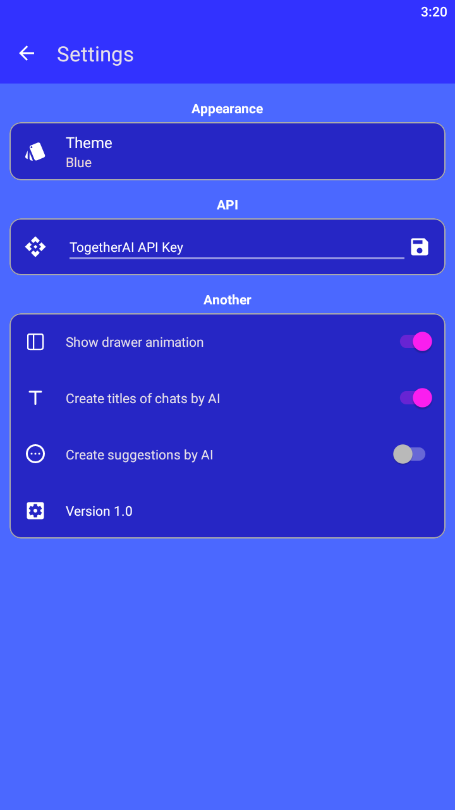
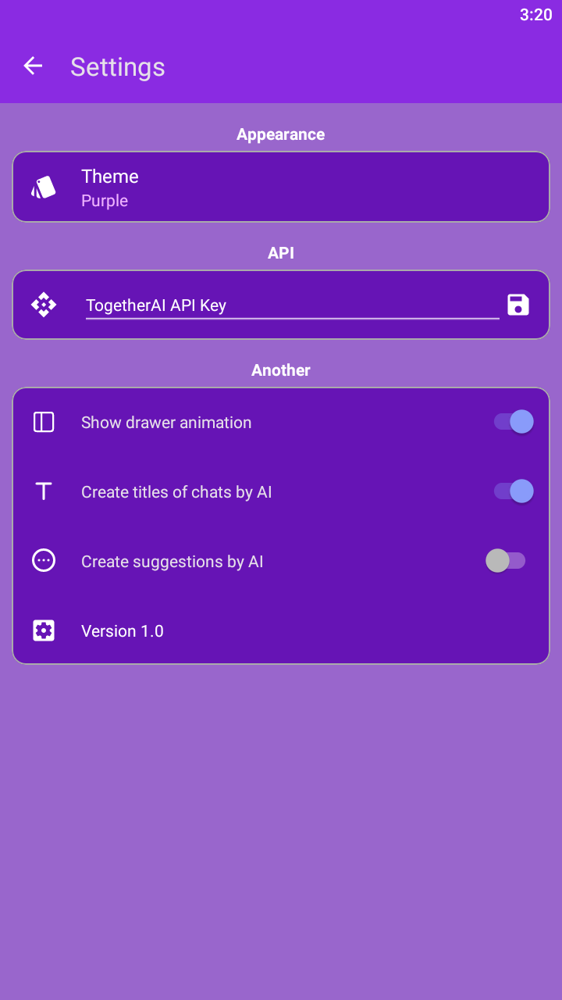
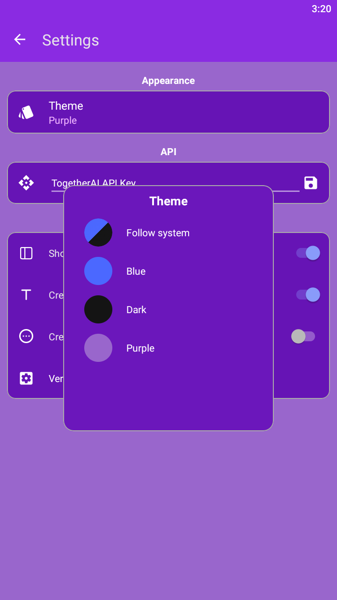

## LeChat

Native Android kotlin app to interact with TogetherAI API!
It offers chat history, multiple chat models that are available at [api.together.xyz](https://api.together.xyz), automatic chat title generation, question suggestions at the bottom of the chat!

## Images

    
    
    
    
    
    
    
    

## To run this App follow these steps:

1. Download APK from the releases tab
2. Install the APK
3. Get your TogetherAI API key [from the website](https://api.together.xyz/settings/api-keys)
4. Paste your API key to the EditText in Settings and click the save button.
5. That's it! Enjoy the app!

## Steps for contributing to this repository:

1. Fork it
2. Create your feature branch: git checkout -b my-new-feature
3. Commit your changes: git commit -am 'Add some feature'
4. Push to the branch: git push origin my-new-feature
5. Create a new Pull Request

## Code Style Guidelines

We use Kotlin and follow the code style based on the Android Kotlin Style Guide.

## App Name suggestions
If you have a good name for the app and want us to consider renaming, feel free to create a new issue!

